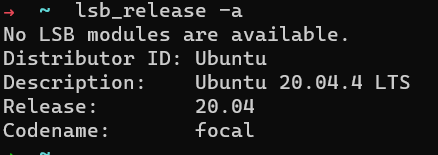

# Face-Blurring 

## (Problem #1) Face Blurring: You are expected to write an algorithm that blurs out people's faces in any given colored image without affecting the remaining parts of the image if any face exists.

## I used to solve the problem open-source library called OpenCV. also, I used  Haar Cascade frontal-face classifier is available as an XML file and is used for detecting faces in an image 👍.

# Steps in python code to implement  Face Blurring 👍:
### 1. Import library  in python (cv2, matplotlib, numpy)
### 2. Create a function called showimage for showing the images using matplotlib.
### 3. Read the image using OpenCV  in BGR format and save it  
### 4. Convert BGR image into an RGB image and save it with the new update
### 5. Shows the image  in RGB format
### 6. use  Haar cascades to  Detect the face in the images and save it at x y w h
### 7. select a bounding box or a rectangular and Draw a rectangle on the detected face Blur the rectangle
### 8. show the output

# Steps for run the code in ubuntu with Visual Studio Code 👍  :
### 1. poetry init -n
### 2.  poetry shell
### 3.  poetry add --dev black flack
### 4.  poetry add opencv-python-headless
### 5.  poetry add matplotlib
### 6.  python Face_Blurring.py test

## Version for Python 👍: Python 3.9.5

## Version for ubuntu 👍: 

## Version for Visual Studio Code 👍:
